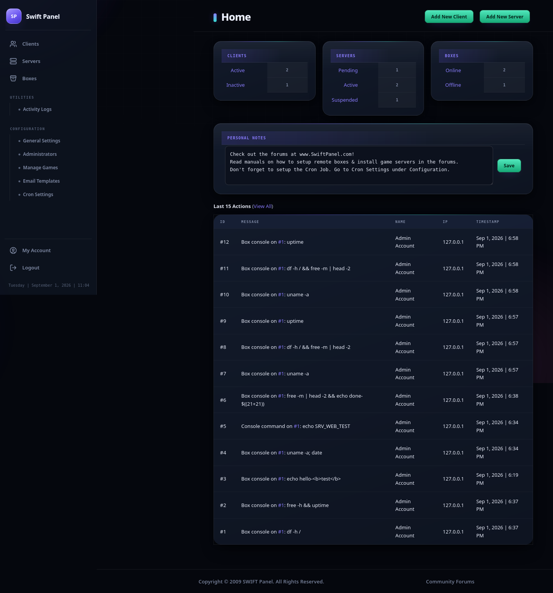
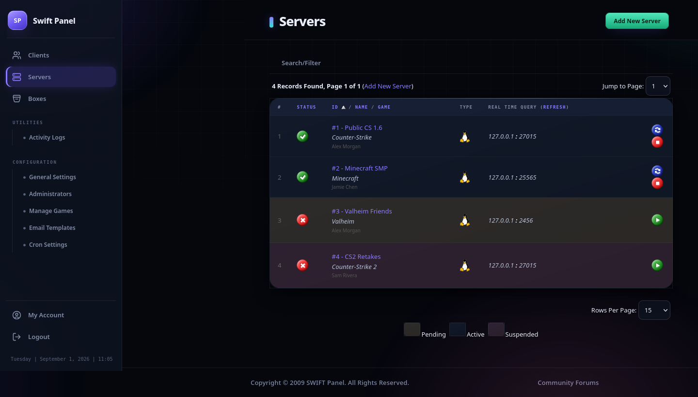
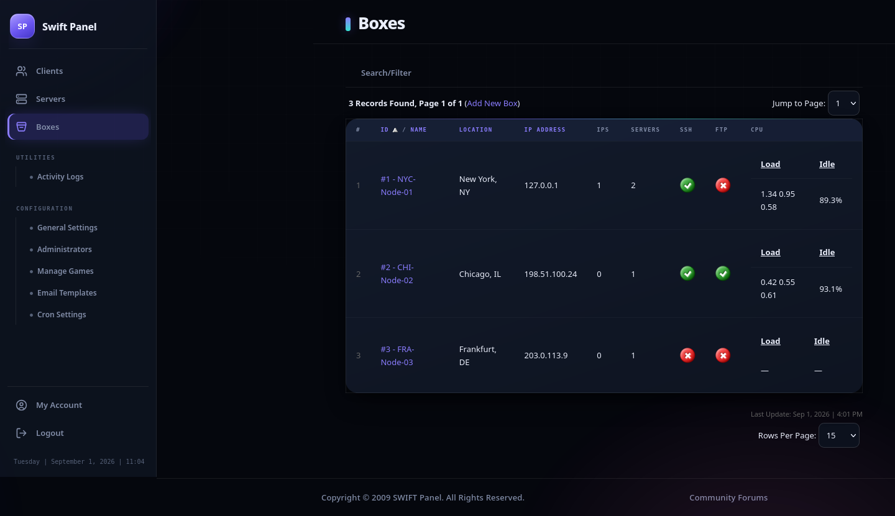
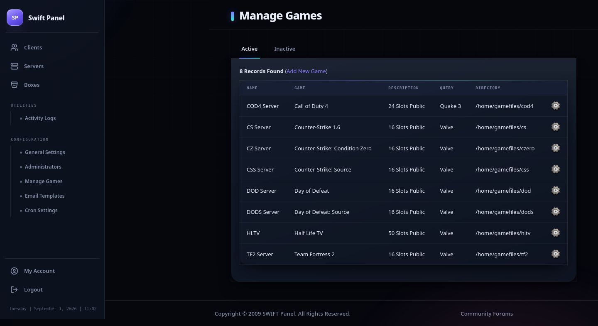
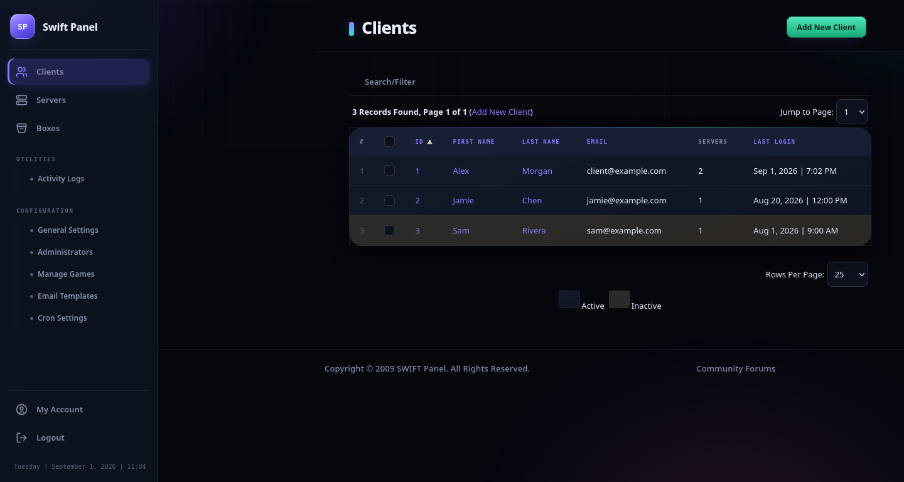
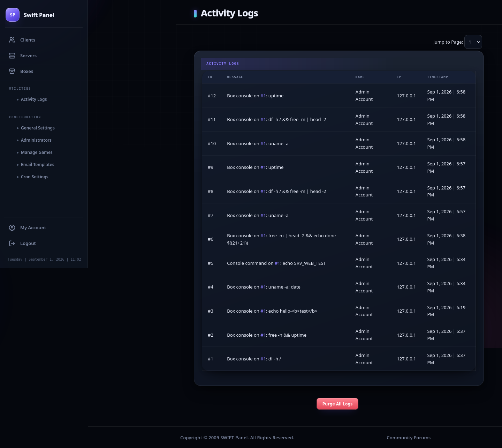
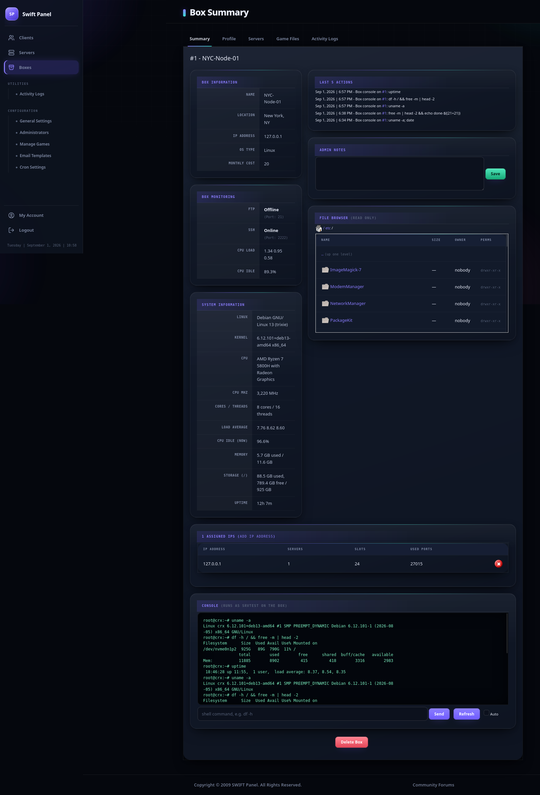
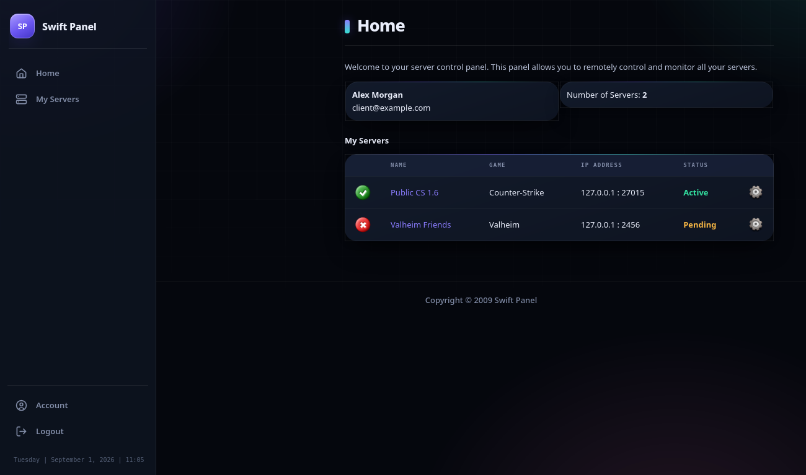
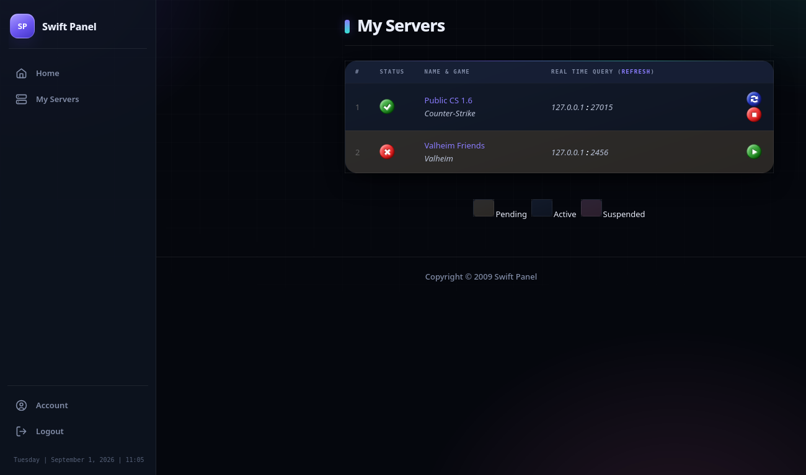

# Swift Panel

A game-server control panel (client area + admin back office), originally written for
PHP 5 / MySQL 5.0 in 2009 and modernised to run on **PHP 8** with `mysqli`.

- Client, game-server, box (node) and reseller-style client management
- Web SSH console + read-only file browser for every box, live system stats
- Passwords hashed with bcrypt (legacy SHA1/plain-text accounts upgrade on next login)
- **TOTP two-factor** for client and admin logins, with a scannable QR code and
  one-time recovery codes
- CSRF, session and SQL-injection hardening built in — see [Security](#security) below
- Runs cleanly on PHP 8.0–8.4, MySQL 5.7+ / MariaDB 10.3+
- Five bundled themes — switch under **Configuration → General Settings**

### Per-server tools (client area)

- **Web FTP** file manager, **console** with quick commands and log download
- **Players** list with kick, live player-count sparkline
- **Schedules** — automatic restart / stop / start / console command / backup, hourly–weekly
- **Backups** — one-click tar.gz snapshots, download and restore
- **FastDL** — the panel serves the server's `fastdl/` directory over HTTP (no web server on the box)
- **Sharing** — give another account view + console + power on a server (subusers)
- **Databases** — self-service MySQL databases with a size guideline
- **Reinstall** — wipe and re-deploy the server files
- **Rename** — change a server's display name from its own summary page

### Account & platform

- **Support tickets** (client ↔ staff threads), **announcements** on the dashboard
- **Notification bell** — down-alerts, finished backups and ticket replies show up
  in-panel, not just by email
- **API keys** + a small REST API (`GET /servers`, `GET /servers/{id}`,
  `POST /servers/{id}/power`) — try it live from **API Keys → try it out** (`/api-test.php`)
  without writing any code
- **Sign-in history**, server **down-detection** with owner email alerts
- Cron collects box + server stats, disk usage, player history, and runs schedules

---

## Screenshots

> The **Aurora** theme (dark). A **Bootstrap** and the classic **Default** theme also ship.

### Admin

| | |
|---|---|
| **Dashboard** — clients / servers / boxes at a glance, live activity feed | **Game servers** — status, ownership, start / stop / restart |
| [](docs/screenshots/admin-dashboard.png) | [](docs/screenshots/admin-servers.png) |
| **Boxes** — SSH / FTP reachability, CPU load & idle from cron | **Manage games** — per-game defaults, executables, query protocol |
| [](docs/screenshots/admin-boxes.png) | [](docs/screenshots/admin-games.png) |
| **Clients** — searchable, paginated, status-coloured | **Activity log** — every action, immutable, `#id` deep-links |
| [](docs/screenshots/admin-clients.png) | [](docs/screenshots/admin-activity-log.png) |

**Box summary** — live system information, a read-only SSH file browser, and an
interactive `screen`-backed console, all on one page:

[](docs/screenshots/admin-box-summary.png)

### Client area

| | |
|---|---|
| **Dashboard** | **My servers** |
| [](docs/screenshots/client-dashboard.png) | [](docs/screenshots/client-servers.png) |

---

## Quick start

**1 — Install the stack** (Apache + MariaDB + PHP + extensions, enable `.htaccess`, start services):

```bash
sudo apt update && sudo apt install -y apache2 mariadb-server php libapache2-mod-php php-mysql php-ssh2 && sudo sed -i '/<Directory \/var\/www\/>/,/<\/Directory>/ s/AllowOverride None/AllowOverride All/' /etc/apache2/apache2.conf && sudo a2enmod rewrite headers && sudo systemctl enable --now apache2 mariadb && sudo systemctl restart apache2
```

**2 — Create the database** (change `CHANGE_THIS`):

```bash
sudo mysql -e "CREATE DATABASE swiftpanel CHARACTER SET utf8mb4; CREATE USER 'swift'@'localhost' IDENTIFIED BY 'CHANGE_THIS'; GRANT ALL ON swiftpanel.* TO 'swift'@'localhost'; FLUSH PRIVILEGES;"
```

**3 — Put the files in the web root:**

```bash
sudo rm -f /var/www/html/index.html && sudo cp -r . /var/www/html/
```

**4 — Enter your DB password** into `configuration.php`:

```bash
sudo nano /var/www/html/configuration.php
```

**5 — Import the schema** (strict SQL mode is relaxed for the import only — the 2009 seed data needs it):

```bash
sudo mysql swiftpanel --init-command="SET SESSION sql_mode=''" < /var/www/html/full.sql
```

**6 — Fix ownership and restart:**

```bash
sudo chown -R www-data:www-data /var/www/html && sudo systemctl restart apache2
```

**7 — Serve it over HTTPS.** The panel works over plain HTTP, but several of the
hardening measures below only fully engage on HTTPS (see [Security](#security)).
A reverse proxy or `certbot --apache` is enough.

---

## Default logins

| Area | URL | Login |
|---|---|---|
| Admin | `/admin/` | `admin` / `password` |
| Client | `/` | created by an admin under *Clients → Add New Client* |

Change the admin password immediately under *My Account*, and turn on two-factor
authentication while you're there — it renders a QR code, so it's one scan away.

---

## Themes

Set the active theme under **Configuration → General Settings → Panel Template**.
Each theme is a self-contained folder (with a matching one under `admin/templates/`):

| Folder | Look |
|---|---|
| `feather-new` | Its own markup (not a reskin): fixed sidebar + top command bar, hero + stat cards, terminal-green, light/dark toggle. |
| `feather` | FeatherPanel-style CSS reskin — dark, green, rounded cards, status pills. |
| `bootstrap` | Bootstrap 5.3 + Bootstrap Icons, light. **Shipped default.** |
| `aurora` | Dark, collapsible icon rail, glass panels, animated background (light-mode aware). |
| `default` | The original 2009 look. |

A theme can ship only a `style.css` (reskin) or its own `header.php` / `footer.php`
and page views (`templates/<theme>/index.php`, …); anything it does not provide
falls back to `default`.

---

## Security

The codebase predates prepared statements and doesn't use an ORM — every query is
built with string concatenation, made safe by consistently running user input
through `sanitizeInput()` / `dbEscape()` (`includes/functions1.php`) before it
touches SQL. **If you add a new query, escape every value going into it — including
a value you already fetched from the database once before** (a value that was
escaped for the query that inserted it is not automatically safe for a second,
different query built later; re-escape at the point of reuse). This is the one
rule that matters most for keeping this app safe going forward.

Everything below ships on by default; there is nothing to turn on.

- **CSRF** — `includes/security.php`'s `requireSameOrigin()` runs at the top of
  every state-changing page (both the client and admin `*process.php` files, plus
  the console endpoints). It checks the request's `Origin` (falling back to
  `Referer`) against the current host and rejects a mismatch; a request with
  neither header — which happens on ordinary same-site clicks in privacy-hardened
  browsers — is allowed through, since the actual forgery signal is a *mismatched*
  origin, not a missing one.
- **Sessions** — the session cookie is `HttpOnly`, `SameSite=Strict`, and `Secure`
  whenever the request came in over HTTPS (`hardenSessionCookieParams()`). Login
  regenerates the session ID. Both client and admin logins lock out after 5 bad
  attempts (password **or** 2FA code) for several minutes.
- **Two-factor** — TOTP (RFC 6238) implemented with no external dependency
  (`includes/totp.php`), ±1 time-step tolerance, 8 single-use recovery codes
  (stored as salted hashes, never in plain text), and a QR code on setup so you
  never have to type the secret in by hand.
- **SQL sorting/search** — the admin list pages (`Clients`, `Servers`, `Boxes`)
  resolve `?orderby=`/`?dir=`/`?search=` against a fixed column allow-list
  (`sqlSortColumn()`/`sqlSortDir()`) rather than trusting the query string
  directly — those parameters sit in an identifier context that quote-escaping
  alone doesn't protect.
- **Output escaping** — everything rendered from user- or game-server-controlled
  data goes through `htmlspecialchars()`; where a value is also embedded in an
  inline `onclick="confirm('…')"` JS string, it additionally goes through
  `addslashes()` first (HTML-entity-decoding happens before the browser's JS
  parser runs, so `htmlspecialchars()` alone doesn't protect a JS-string context).
  A handful of places render real HTML on purpose — activity-log messages and
  notification bodies build their own safe `<a href>` links server-side; nothing
  user-typed reaches those `innerHTML`-equivalent sinks unescaped.
- **File uploads** — an uploaded FTP filename is stripped of path separators and
  control bytes before it's written to the remote path or rendered back
  (`sanitizeUploadFilename()`).
- **Open redirects** — every post-login `?return=` target is checked against a
  local-relative-path allow-list (`safeReturnPath()`) before it's used in a
  `Location:` header.
- **Mail** — the built-in `PHPMailer`-compatible shim (`includes/class.phpmailer.php`,
  a dependency-free stand-in using PHP's `mail()`) strips CR/LF from every
  address/name/subject before building headers, closing off header injection.
- **The one thing you must configure yourself:** the client-database feature
  (below) needs the panel's own MySQL user to hold broad `CREATE`/`GRANT`
  privileges. Only enable it if you're comfortable with that trust boundary, and
  keep that DB user's password as strong as any admin password.

None of the above touches the **console** or **box console** features — running
arbitrary commands on your own server via the console is an intentional,
accepted capability of this panel, not a bug. Everything else — who can *reach*
a console endpoint, and CSRF on the endpoint itself — is still in scope and
covered above.

---

## Notes

- `full.sql` is the complete schema **and** seed data — one file, fresh installs only.
- `configuration.php` holds the DB credentials; the bundled `.htaccess` blocks it, every
  `*.sql` and `*.md` file, and `/includes/` from being served. On nginx, replicate those
  denies in the server block.
- Box/server management needs the `ssh2` PHP extension and key or password SSH access to
  each managed machine.
- Schedules, backups, down-alerts, disk usage and player history are driven by
  `admin/cron.php` — run it every 1–2 minutes:
  `*/2 * * * * php -q /var/www/html/admin/cron.php`
  (it detects the correct path from the crontab's own invocation, so run it via
  cron rather than manually with `cd ... && php admin/cron.php`).
- Self-service client databases (**Configuration → General Settings → Client MySQL
  Databases**) create databases on the panel's own MySQL server, so its DB user needs
  `CREATE`, `CREATE USER` and `GRANT OPTION` globally — see the grant in
  `includes/dbctl.php`. Optionally set a phpMyAdmin URL there for a management link.
- FastDL and the REST API need `mod_rewrite` and `AllowOverride All` (the apt one-liner
  above sets both).
- The REST API is documented and testable in-panel at **API Keys → try it out**
  (`/api-test.php`) — no separate API docs to keep in sync.
